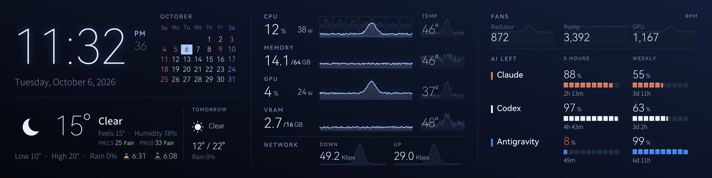
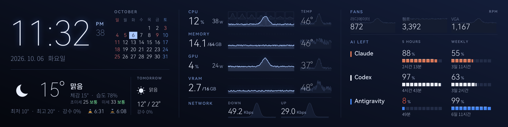
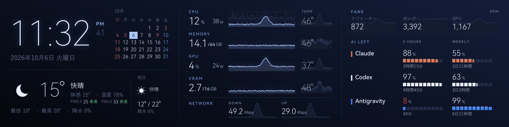

# turzx-ai-monitor

A replacement dashboard for the **TURZX 8.8" USB bar LCD** (1920×480) on Windows.
It shows how much of your AI plans is left — **Claude, Codex and Antigravity** — next to
CPU / GPU / RAM / VRAM load, temperatures and power, fans, network, a clock, a calendar with
public holidays, and the weather with air quality.

[한국어 README](README.ko.md)



| Korean | Japanese |
|---|---|
|  |  |

When Windows shuts down, the panel switches to a standby screen and keeps it until the next start:


## Features

- **AI plan usage**: what is left of the 5-hour and weekly limits, with the time until each resets.
  Refreshes right after a reset.
- **Hardware**: CPU (with per-core graphs), memory, GPU and VRAM usage with history graphs,
  temperatures, CPU package and GPU board power, two board fans and the GPU fan, network up/down.
- **Clock and calendar** (12/24-hour) with the public holidays of your country.
- **Weather** for your city: now, tomorrow, sunrise/sunset, PM2.5/PM10 with Korean or US AQI grades.
- **16 languages**: English, 한국어, 日本語, 简体中文, 繁體中文, Español, Français, Deutsch,
  Italiano, Português, Русский, Polski, Türkçe, Nederlands, Tiếng Việt, Bahasa Indonesia.
- **Light on the PC**: one process, ~65 MB, ~5% of one core in Windows efficiency mode.
- **Robust**: reconnects within a second when the USB cable is knocked, restarts itself if a
  driver crashes it, black screen while the PC is locked.

## Requirements

- Windows 10 or 11 (x64)
- TURZX 8.8" USB LCD (USB `1CBE:0088`, 480×1920). Close the vendor app first; only one program
  can drive the panel.
- Optional:
  - an NVIDIA GPU for GPU/VRAM readings
  - [PawnIO](https://pawnio.eu) (also installed by FanControl) for CPU/RAM temperatures, CPU power
    and board fans. Board fan channels are currently set up for Nuvoton Super I/O chips.
  - Claude Code, Codex or Antigravity signed in on this PC for the AI usage

## Install

1. Download `turzx-dashboard.exe` from [Releases](../../releases) (or build it, below).
2. Double-click it and answer **Yes** to install. It copies itself to
   `%LOCALAPPDATA%\Programs\TurzxDashboard`, adds Start menu shortcuts and an entry in
   *Settings → Apps*, starts with Windows and starts now.
   - With PawnIO installed, autostart is a scheduled task with administrator rights (one UAC
     prompt during install, none at logon) so all sensors work.
   - Without PawnIO it uses the normal startup list (no prompt).

From a terminal:

```
turzx-dashboard install [--no-autostart]
turzx-dashboard uninstall [--purge]     # --purge also removes settings, logs and caches
turzx-dashboard autostart on|off
turzx-dashboard settings                # open the settings file
turzx-dashboard run                     # run without installing
```

Uninstall from *Settings → Apps → TURZX AI Monitor* or with `turzx-dashboard uninstall`.

## Settings

`%APPDATA%\TurzxDashboard\config.toml` (Start menu: *TURZX AI Monitor settings*). Save it and the
dashboard restarts with the new settings.

```toml
language = "auto"        # auto = Windows display language; en, ko, ja, zh-CN, zh-TW, es, fr, de, it, pt, ru, pl, tr, nl, vi, id
clock = "12h"            # or "24h"
temperature = "C"        # or "F"

[location]
city = "Seoul"           # looked up by name; or set latitude / longitude
# latitude = 37.5665
# longitude = 126.978

[holidays]
country = "auto"         # ISO code ("US", "JP", "DE", ...), auto = Windows region, or "none"

[air_quality]
scale = "auto"           # "kr" (Korean grades), "us" (US AQI); auto = kr in Korea

[ai]
claude = true
codex = true
antigravity = true

[fans]
labels = []              # e.g. ["Radiator", "Pump", "GPU"]
```

## How the AI usage is read

The dashboard reads the login each tool already stores on your PC and asks the same usage
endpoints those tools and [CodexBar](https://github.com/steipete/CodexBar) use. Nothing is sent
anywhere else, and credentials are only read, never written.

- **Claude**: Claude Code's OAuth usage endpoint, every 15 minutes (it rate-limits hard). When it
  fails, the `/usage` screen of Claude Code is read instead, every 5 minutes, until the API works again.
- **Codex**: ChatGPT's usage endpoint with the Codex CLI login, every 5 minutes.
- **Antigravity**: Google's Cloud Code quota endpoint with the Antigravity login, every 5 minutes.

These endpoints are not public APIs and may change or stop working. Turn off any of them under `[ai]`.

## Data and services

- Weather and air quality: [Open-Meteo](https://open-meteo.com) (no key; city lookup by its geocoding API).
  Air quality is the CAMS model, not station measurements.
- Holidays: built-in table for Korea, [Nager.Date](https://date.nager.at) for other countries.
- Logs: `%LOCALAPPDATA%\TurzxDashboard\dashboard.log`.

## Build

Requires Rust (stable) on Windows.

```
cd rust
cargo build --release
```

`turzx-dashboard diag <command>` renders previews and runs checks without the panel:
`layout`, `standby`, `sensors`, `weather`, `profile`, `jpeg-check`, `fps-test`, `test-pattern`.
`TURZX_LANGUAGE=ja` overrides the language for a preview.

How the panel is driven (USB protocol, JPEG frames, partial re-encoding): [docs/protocol.md](docs/protocol.md).

## License

MIT, see [LICENSE](LICENSE). Bundled fonts and PawnIO modules keep their own licenses:
[THIRD_PARTY_NOTICES.md](THIRD_PARTY_NOTICES.md). Not affiliated with TURZX, Anthropic, OpenAI or Google.
